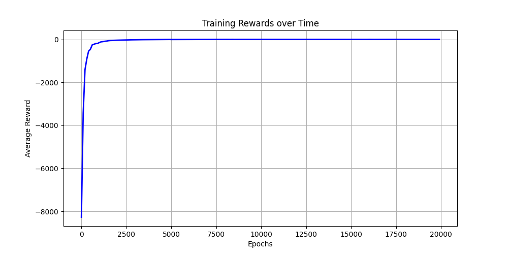
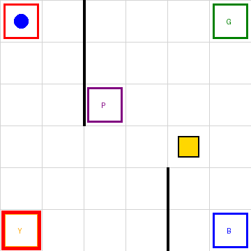
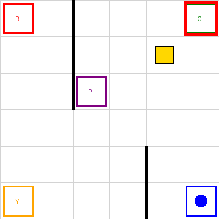

# Reinforcement Learning - Özelleştirilmiş Taxi-v3 Projesi

Bu proje, Derin Pekiştirmeli Öğrenme dersi için verilen "Taxi-v3 ortamının büyütülerek (6x6) ve zorlaştırılarak (5 hedefli) yeniden eğitilmesi" ödevi kapsamında hazırlanmıştır.

Standart `Taxi-v3` yapısı, çok daha gelişmiş ve görsel olarak render edilebilen yepyeni bir ortama dönüştürülmüştür. 

## 📌 Proje Gereksinimleri ve Geliştirmeler

Hoca tarafından belirtilen isterler doğrultusunda şu geliştirmeler yapılmıştır:

1. **Harita Büyütülmesi (5x5 -> 6x6):** Taksinin dolaştığı grid alanı 36 hücreye çıkartılmıştır. Bu durum ajanın hareket olasılıklarını ve haritayı öğrenme sürecini zorlaştırmaktadır.
2. **Hedef (Durak) Sayısının Artırılması (4 -> 5):** R (Kırmızı), G (Yeşil), Y (Sarı) ve B (Mavi) noktalarına ek olarak haritanın ortalarına **P (Mor/Pembe)** durağı eklenmiştir.
3. **Özgün Duvarlar (Engeller):** Ajanın dümdüz hedefe gitmesini engellemek için harita içerisine çeşitli duvarlar yerleştirilmiş ve çevresinden dolaşması sağlanmıştır.
4. **Durum Uzayının (State Space) Büyümesi:** 6x6 grid, 6 yolcu konumu (5 durak + taksi içi) ve 5 hedef noktası ile toplam durum sayısı standart 500'den **1080'e** çıkmıştır.
5. **Özelleştirilmiş Görselleştirme:** Ajanın hareketlerini net olarak görebilmek adına metin (ANSI) tabanlı değil, doğrudan görüntü (RGB) tabanlı **Pillow (PIL)** kullanılarak temiz ve özgün bir görselleştirme motoru yazılmıştır.
6. **Eğitim Grafiği & GIF Çıktısı:** Eğitimin nasıl ilerlediğini kanıtlamak adına bir ödül grafiği ve eğitilmiş ajanın test senaryosundaki performansını gösteren animasyonlu bir **GIF** otomatik olarak oluşturulmaktadır.

## 🛠️ Dosya Yapısı

* **`.gitignore`**: Gereksiz (örneğin Jupyter) dosyaların git reposuna yüklenmesini engeller.
* **`agent_6x6.py`**: İçerisinde `EnhancedTaxi6x6` adlı özel Gym ortamını barındıran, ajanı 20.000 epoch boyunca Q-Learning ile eğiten, grafiğini çizen ve test anını GIF'e çeviren ana çalışma dosyasıdır.
* **`requirements.txt`**: Projenin çalışması için gereken Python kütüphanelerini listeler.
* **`training_graph.png`**: Eğitim süresince elde edilen ödüllerin zamana göre değişimini gösteren grafik.
* **`taxi_test_1.gif` & `taxi_test_2.gif`**: Ajanın test aşamasındaki hareketlerini kare kare gösteren 2 farklı sonuç animasyonu.

## 🚀 Kurulum ve Çalıştırma

Projeyi kendi bilgisayarınızda çalıştırmak için aşağıdaki adımları izleyebilirsiniz:

1. Gerekli kütüphaneleri yükleyin:
   ```bash
   pip install -r requirements.txt
   ```
2. Eğitimi başlatın (Eğitim sonrası grafik ve GIF otomatik oluşacaktır):
   ```bash
   python agent_6x6.py
   ```

## 🧠 Q-Learning Hiperparametreleri ve Eğitim

* **Bölüm (Epoch) Sayısı:** 20.000
* **Öğrenme Oranı (Alpha):** 0.1
* **İndirim Faktörü (Gamma):** 0.99
* **Keşif Oranı (Epsilon):** 1.0 (Başlangıç), zamanla azalarak 0.01 seviyesine iner (Decay: 0.9995).

Ajan ilk başta rastgele hareketlerle (Exploration) haritayı ve engelleri tanımakta, ardından Q-Tablosunu doldurdukça (Exploitation) en kısa yolları kullanmaya başlamaktadır.

## 📊 Çıktılar ve Sonuç

Uygulamayı çalıştırdığınızda ajan başarılı bir şekilde ortamı öğrenir. Eğitim boyunca ajanın gelişimi ve nihai test sonucu aşağıda sunulmuştur:

### Eğitim Grafiği (20.000 Epoch)


### Test Senaryosu Animasyonları (2 Farklı Senaryo)
<div style="display: flex; justify-content: space-between;">
  
  
</div>
